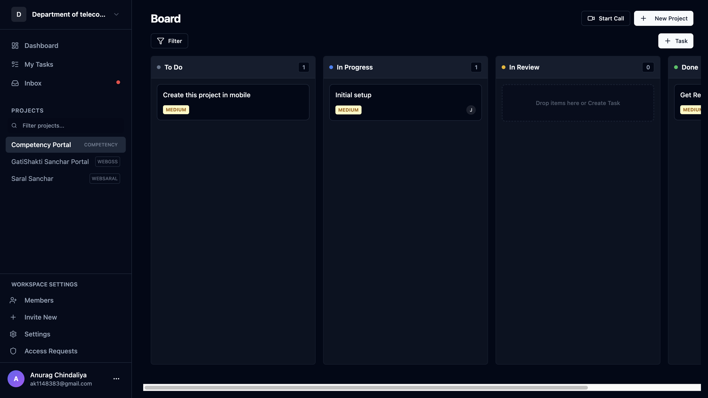
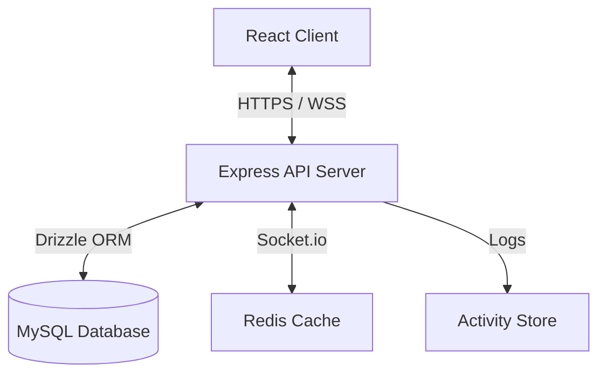

# 🚀 Project Management Platform

[](https://opensource.org/licenses/MIT)
[](https://www.typescriptlang.org/)
[](https://reactjs.org/)
[](https://nodejs.org/)
[](https://orm.drizzle.team/)
[](https://www.mysql.com/)

A enterprise-grade project management application featuring real-time collaboration, role-based access control, and a sleek glassmorphism UI.



---

## ✨ Key Features

- **Multi-Workspace Organization**: Effortlessly manage multiple teams and departments.
- **Dynamic Kanban Board**: Drag-and-drop tasks across custom columns with real-time sync.
- **Real-time Collaboration**: Powered by Socket.io for instant updates, typing indicators, and presence.
- **Advanced Permissions (RBAC)**: Granular control with Owner, Admin, Member, and Viewer roles.
- **Audit Trails**: Full activity logs for transparency and compliance.
- **Rich Task Details**: Support for comments, attachments, subtasks, and priority levels.
- **Stunning UI**: Modern glassmorphism aesthetic built with Tailwind CSS and Shadcn UI.

---

## 🛠 Tech Stack

| Frontend | Backend | Database & DevOps |
| :--- | :--- | :--- |
| **React 18** (Vite) | **Node.js** (Express) | **MySQL 8.0** |
| **TypeScript** | **TypeScript** | **Drizzle ORM** |
| **Tailwind CSS** | **Socket.io** | **Docker & Compose** |
| **TanStack Query** | **Zod** (Validation) | **Redis** (Scaling) |
| **Zustand** | **JWT** (Auth) | **Adminer** |

---

## 🏗 Modular Architecture



---

## 🚀 Quick Start

### Prerequisites
- Node.js 18+ & pnpm/npm
- Docker Desktop

### 1. Setup Server
```bash
cd server
cp .env.example .env # Update with your credentials
npm install
docker-compose up -d
npm run db:push
npm run db:seed
npm run dev
```

### 2. Setup Client
```bash
cd client
npm install
npm run dev
```

The application will be available at `http://localhost:5173`.

---

## 📱 Mobile App

The project includes a cross-platform mobile application located in the `/mobile` directory. It shares the same backend and business logic for a seamless experience on the go.

---

## 📚 API Overview

Detailed API documentation is available in the [API Documentation](./server/docs/api.md) (or see the routes in `server/src/api/routes`).

### Core Endpoints:
- `POST /api/v1/auth/login` - User Authentication
- `GET /api/v1/workspaces` - Workspace Management
- `GET /api/v1/projects` - Project Organization
- `PATCH /api/v1/tasks` - Task Lifecycle

---

## 🤝 Contributing

We welcome contributions! Please see our [Contributing Guidelines](CONTRIBUTING.md) for more details.

1. Fork the Project
2. Create your Feature Branch (`git checkout -b feature/AmazingFeature`)
3. Commit your Changes (`git commit -m 'Add some AmazingFeature'`)
4. Push to the Branch (`git push origin feature/AmazingFeature`)
5. Open a Pull Request

---

## 📄 License

Distributed under the MIT License. See `LICENSE` for more information.

Built with ❤️ by the Project Management Team.
